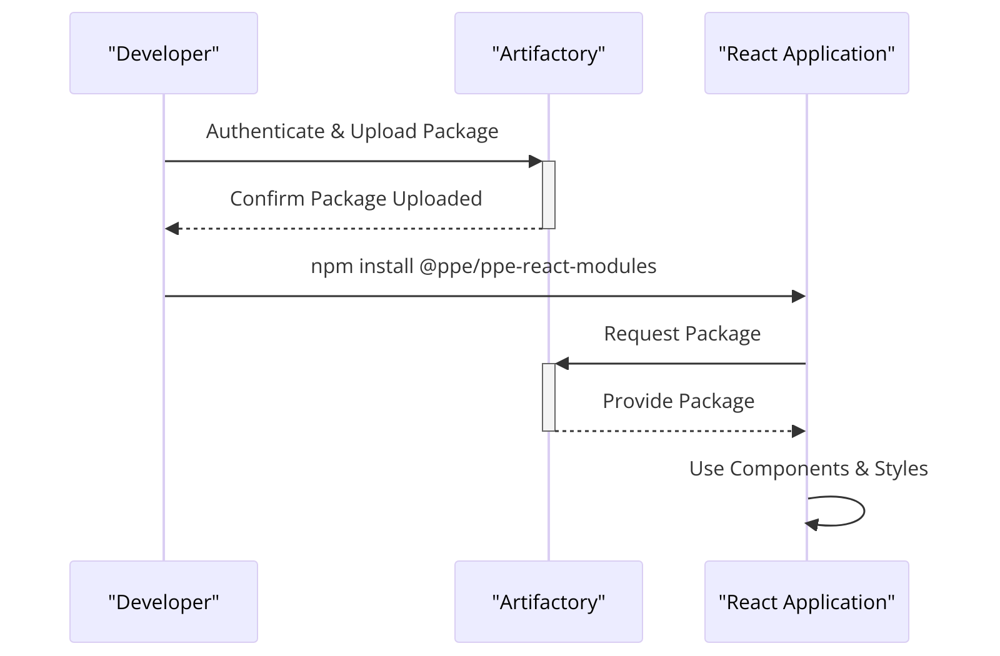

# PPE React Components Library
 PPE React Components Library! This repository is designed to house a collection of reusable React components

## Getting Started

### Setting Up for Publication to Artifactory

To build the application and publish it to Artifactory, follow these preliminary steps:

1. **Authenticate with Artifactory**: Securely fetch the necessary NPM packages from Artifactory by storing credentials locally. Run the following command, replacing `<artifactory_username>` and `<artifactory_password>` with your actual credentials:

    ```bash
    curl -u<artifactory_username>:<artifactory_password> https://rt.artifactory.tio.systems/artifactory/api/npm/npm-ppe-internal-virtual/auth/ppe >> .npmrc
    ```

2. **Build the Application**: Execute the build script defined in `package.json` to compile the application:

    ```bash
    npm run build
    ```

This process will generate CSS files and prepare the application for publication.

### Publish Configuration

Our `package.json` includes a publish configuration pointing to the internal Artifactory repository. When you're ready to publish a new version of your package, ensure you update the version number in `package.json` and then run:

```bash
npm publish --scope=@ppe
```

This command publishes your package to the specified Artifactory repository.

## Installing and Using Components

To use the components in your React application, you first need to install the package:

```bash
npm install @ppe/ppe-react-modules
```

### Importing CSS Styles

Incorporate the core CSS styles by importing them into your main SCSS file:

```scss
@use "@ppe/ppe-react-modules/dist/ppe-styleguide-core";
```

This import statement includes all necessary CSS into your application.

### Utilizing Components

Here is how you can use the provided React components:

- **React Button**:

    ```javascript
    import { Button } from '@els/els-react--button';

    <Button
      onClick={function (e) {
        console.log('Button clicked', e);
      }}
      type="secondary"
    >
      Button text
    </Button>
    ```

- **Table Component**:

    For the table components like `Body`, `Cell`, `Grid`, `Head`, etc., import them from the package and use them as needed:

    ```javascript
    import { Body, Cell, Grid, Head, Header, HeaderCell, HeaderRow, Row, Table, WrapperRow } from '@ppe/ppe-react-modules';

    <Table label="tasklist" className="c-person__table">
        <Header>
          <Head>
            <HeaderRow>
              <HeaderCell className="c-person__name">FullName</HeaderCell>
              <HeaderCell className="c-person__bio">Bio</HeaderCell>
              <HeaderCell className="c-person__job-title">Job Title</HeaderCell>
              <HeaderCell className="c-person__email-id">Email Id</HeaderCell>
              <HeaderCell className="c-person__zodiac-sign">Zodiac Sign</HeaderCell>
            </HeaderRow>
          </Head>
        </Header>
        <Grid>
          <Body>
            {persons.map(person => {
              return (
                <WrapperRow key={person.name}>
                  <Row key={person.name}>
                    <Cell className="c-person__name">{person.name}</Cell>
                    <Cell className="c-person__bio">{person.bio}</Cell>
                    <Cell className="c-person__job-title">{person.jobTitle}</Cell>
                    <Cell className="c-person__email-id">{person.emailId}</Cell>
                    <Cell className="c-person__zodiac-sign">{person.zodiacSign}</Cell>
                  </Row>
                </WrapperRow>
              )
            })}
          </Body>
        </Grid>
      </Table>
    ```

## Flow Diagram: From Artifactory to React Application

The following diagram illustrates how components are built, published to Artifactory, and then used within a React application:


